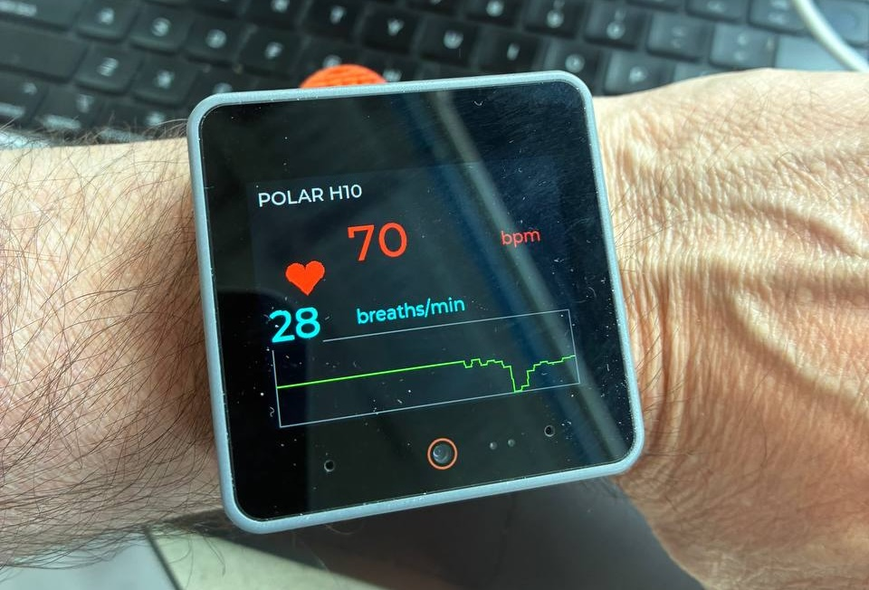

# micropython-polar-h10

Read the **Polar H10's proprietary accelerometer stream** on a microcontroller.
A MicroPython / [aioble](https://github.com/micropython/micropython-lib/tree/master/micropython/bluetooth/aioble)
BLE-central driver for the H10's Polar Measurement Data (PMD) service, targeting
the ESP32 family.



*The [`dashboard_cores3.py`](examples/dashboard_cores3.py) example: heart rate,
a breaths/min estimate derived from the chest accelerometer, and a live
breathing waveform — driven from an M5Stack CoreS3, no phone or computer.*

```
pip / mip name:   micropython-polar-h10     ← what you install
import name:      polar_h10                  ← what you type in code
```

> **Not affiliated with or endorsed by Polar Electro Oy.** "Polar" and "H10" are
> trademarks of their respective owner and are used here only to describe the
> hardware this library talks to.

> **Not a medical device.** This library is for research, prototyping, and hobby
> use. Do not use it for diagnosis, treatment, or any safety-critical purpose.

---

## Why this exists

The H10's heart-rate and RR-interval data is plain Bluetooth GATT and works
anywhere. The **accelerometer** (and ECG) ride on Polar's vendor-specific PMD
service, which needs a control-point handshake and a delta-decoder to read.

Several good libraries do this **on a desktop** over Bleak — `bleakheart`,
`polar-python`, `polarpy`. None of them run on a microcontroller. This library
fills that gap: it connects to the H10 directly from an ESP32 with no phone and
no computer in the loop, so the strap can feed an embedded system in the field.

## Features

- BLE-central connection to the H10 from MicroPython (aioble), pairing
  automatically (the PMD service requires an encrypted link — see below).
- Starts and stops the PMD accelerometer stream (25 / 50 / 100 / 200 Hz; 2 / 4 / 8 G).
- Decodes the delta-compressed PMD frames into `(x, y, z)` samples in mG, with
  per-sample timestamps reconstructed from the frame's device clock.
- Decodes the **standard heart-rate** characteristic (bpm + RR-intervals), and
  can stream HR and accelerometer over the **one** connection at once.
- An optional **respiration estimator** (`polar_h10/resp.py`) that derives a
  breaths-per-minute estimate from the chest accelerometer (good at rest; an
  estimate, not a measurement — see Limitations).
- A **transport-independent protocol core** (`polar_h10/pmd.py`) with zero BLE
  dependency — the same byte logic runs under Bleak on a laptop and aioble on
  the device, so you can develop and verify on desktop, then deploy unchanged.

## Hardware

- An ESP32 with BLE (developed on an M5Stack CoreS3 / ESP32-S3).
- A MicroPython build with **BLE pairing/bonding enabled** and `aioble` available.
  The H10's PMD service only responds over an **encrypted link**, so the driver
  pairs on connect (`PolarH10` does this automatically); a firmware without
  pairing support will fail every PMD write with ATT *Insufficient
  Authentication* (0x05). The stock M5Stack CoreS3 firmware (MicroPython 1.27)
  supports it.
- A Polar H10 chest strap. **It must be worn (or its electrodes wetted) to
  advertise** — a dry strap on a desk will not show up in a scan.
- Only one BLE central can hold the H10 at a time; close the Polar/phone app first.

## Install

You need three things on the board: a MicroPython build with BLE
pairing/bonding (see [Hardware](#hardware)), the `aioble` package, and this
`polar_h10` package.

**With [`mip`](https://docs.micropython.org/en/latest/reference/packages.html)**
(convenient; the board must be on WiFi). This pulls `polar_h10/` plus the
`aioble` dependency listed in [`package.json`](package.json):

```python
import mip
mip.install("github:daan/micropython-polar-h10")
```

> ⚠️ The `mip` path is wired up but **not yet verified on-device** — development
> used the manual copy below. If you try `mip`, please report back.

**Manually with [`mpremote`](https://docs.micropython.org/en/latest/reference/mpremote.html)**
from your laptop (the verified path, and works with no board WiFi):

```sh
# 1. aioble (download its .py files from micropython-lib, then copy the package dir)
mpremote mip install aioble                  # if the board has WiFi, otherwise copy the files
# 2. this package
mpremote cp -r polar_h10 :/lib/              # any dir on the board's sys.path
```

On most builds `/lib` is on `sys.path`; on the M5Stack CoreS3 it's `/flash/libs`.
Confirm with `mpremote exec "import sys; print(sys.path)"`, and check it imports:
`mpremote exec "import polar_h10; print(polar_h10.__version__)"`.

### Desktop development

The protocol core is developed and verified on a laptop with
[`uv`](https://docs.astral.sh/uv/):

```sh
uv sync                                   # creates .venv, installs bleak + pytest
uv run pytest                             # wire-format tests (no hardware)
uv run python examples/acc_desktop.py     # stream from a real strap over Bleak
```

## Quick start

On the device, the `polar_h10.central` aioble transport wraps the scan / connect
/ subscribe / start dance behind a small async context manager:

```python
import asyncio
from polar_h10.central import find_h10, PolarH10

SAMPLE_RATE = 200  # Hz

async def main():
    device = await find_h10()  # scans by name; strap must be worn/wetted
    if device is None:
        print("No Polar H10 found")
        return
    async with PolarH10(device) as h10:          # connect + pair + MTU + subscribe
        await h10.start_acc(sample_rate=SAMPLE_RATE, range_g=8)
        while True:
            out = await h10.read_frame(fs=SAMPLE_RATE)
            for (x, y, z) in out["samples"]:
                print(x, y, z)  # milli-g

asyncio.run(main())
```

`find_h10` / `PolarH10` are the only BLE-touching parts; everything they call
(`build_acc_start_command`, `parse_acc_frame`, …) lives in the transport-free
`polar_h10.pmd` core and is importable on any platform.

## Package layout

```
polar_h10/            # the installable package — this is what flashes to the board
  __init__.py         # re-exports the pure core only (so `import polar_h10` works on desktop)
  pmd.py              # transport-independent protocol: ACC command/decode + HR decode
  central.py          # aioble transport (MicroPython-only; imports aioble); ACC + HR
  resp.py             # optional: breaths/min estimate from the chest accel (pure Python)
examples/
  acc_print.py        # on-device runnable (aioble) — mirror of the quick start
  acc_desktop.py      # the SAME pmd.py core driven by Bleak on a laptop, for verification
  dashboard_cores3.py # M5Stack CoreS3-specific demo: HR + breathing + waveform on screen
tests/
  test_pmd.py         # wire-format tests for the core (ACC + HR); run with pytest
  test_resp.py        # respiration-estimator tests against a synthetic breathing signal
package.json          # mip manifest — the exact files deployed to the device
pyproject.toml        # desktop dev tooling (bleak, pytest) — never deployed
```

The split is deliberate: `pmd.py` imports nothing platform-specific and runs
identically under CPython (bleak) and MicroPython (aioble); `central.py` is the
only file that imports `aioble`, and `__init__.py` does **not** import it — that
is what keeps `import polar_h10` working on the laptop where `aioble` is absent.
The bleak driver stays in `examples/` (dev-only) and is never flashed.

## Heart rate and respiration

**Heart rate** is plain GATT (service `0x180D`), no PMD handshake and no
encryption needed. Pass `hr=True` to stream it alongside (or instead of) the
accelerometer on the same connection:

```python
async with PolarH10(device, acc=True, hr=True) as h10:
    await h10.start_acc(sample_rate=50, range_g=8)
    # in separate tasks:
    hr  = await h10.read_hr()      # {"bpm": int, "contact": bool|None, "rr_ms": [...]}
    out = await h10.read_frame(fs=50)
```

`parse_hr_measurement(data)` in `pmd.py` decodes the raw characteristic if you
want to drive HR without the helper.

**Respiration** (`polar_h10/resp.py`) derives a breaths-per-minute estimate by
band-passing the chest accelerometer to the breathing band (~0.1–0.6 Hz) and
counting cycles:

```python
from polar_h10.resp import RespirationEstimator
est = RespirationEstimator(fs=50)
for (x, y, z) in out["samples"]:
    est.feed(x, y, z)
print(est.rate_bpm)   # breaths/min, or None until enough breaths are seen
```

It's reliable when the wearer is still; body motion lives in the same frequency
band and will swamp it (see Limitations).

## Example: CoreS3 dashboard

`examples/dashboard_cores3.py` is a self-contained demo for the **M5Stack CoreS3**
that shows live heart rate (with a pulsing heart), the breaths/min estimate, and
a scrolling breathing waveform. It is board-specific: it uses the M5 firmware's
`M5.Display` API, and **must run from boot** (deploy as the board's `/flash/main.py`),
not via `mpremote run` — heavy drawing over the USB-CDC link is unreliable. It
keeps a "tap the screen for REPL" escape hatch so you can recover the board. Treat
it as a worked example, not part of the core driver.

## Protocol notes

`pmd.py` documents the wire format inline: the PMD service/characteristic UUIDs,
the control-point start command (`0x02` start, `0x02` ACC, then sample-rate /
resolution / range setting blocks), and the delta-frame layout (10-byte header,
reference sample, then byte-aligned `[bit-width][count][packed deltas]` groups
accumulated onto the running value). Values are milli-g.

Format derived from Polar's publicly documented PMD specification in the
[official BLE SDK](https://github.com/polarofficial/polar-ble-sdk) (MIT) and
cross-checked against the desktop libraries below.

**Encryption is mandatory for PMD.** The H10 rejects every control-point write
and notify-enable on an unencrypted link with ATT *Insufficient Authentication*
(0x05), then drops the connection. Desktop BLE stacks (CoreBluetooth, BlueZ)
pair on demand transparently, which is why the bleak path "just works"; on
aioble the central must pair explicitly, so `PolarH10` calls `connection.pair()`
before resolving the service. (Plain heart-rate/RR GATT, by contrast, needs no
encryption.)

## Development path

The protocol core is identical on desktop and device, so the recommended
workflow is:

1. `uv run pytest` — exercise `pmd.py`'s wire format against known frames, no
   hardware needed. (For maximum fidelity you can also run the same file under
   the MicroPython unix port: `micropython tests/test_pmd.py`.)
2. `uv run python examples/acc_desktop.py` — drive `pmd.py` with Bleak against a
   real strap and confirm decoded samples look right (rate, gravity magnitude).
3. Copy `aioble` and `polar_h10/` to the board (e.g. with `mpremote`) and run
   `examples/acc_print.py` — the same core over aioble. Only the transport
   scaffolding differs (and it pairs first, since PMD needs an encrypted link).

## What's verified, and limitations

Verified against a real Polar H10:

- Accelerometer decode, on a laptop over Bleak and on an **M5Stack CoreS3**
  (MicroPython 1.27) over aioble — decoded vectors match gravity (~1000 mG).
- The CoreS3 keeps up with the **100 Hz** stream with no dropped samples
  (checked against the device clock; it free-runs at ~102 Hz).
- Heart rate + RR-intervals, streamed concurrently with the accelerometer.
- Automatic pairing on connect (required by the PMD service).

Known limitations / not yet verified:

- **200 Hz throughput on-device** was not re-checked for dropped samples; 100 Hz
  is the confirmed-clean rate on the CoreS3. (Desktop handles 200 Hz fine.)
- **`mip` install** is configured but untested on-device (the manual `mpremote`
  copy is the verified path).
- **Respiration is an estimate** from chest motion — fine sitting still,
  unreliable during movement; it is not a respiration measurement.
- Tested on one board (CoreS3) and one strap. Other ESP32 boards should work
  given pairing-capable firmware + aioble, but are unconfirmed.
- Not a medical device; see the notice at the top.

## Acknowledgements

- [`bleakheart`](https://github.com/fsmeraldi/bleakheart),
  [`polar-python`](https://github.com/zHElEARN/polar-python),
  [`polarpy`](https://github.com/wideopensource/polarpy) — desktop references.
- Polar's open-source BLE SDK technical documentation for the PMD spec.

## License

MIT — see [LICENSE](LICENSE).
